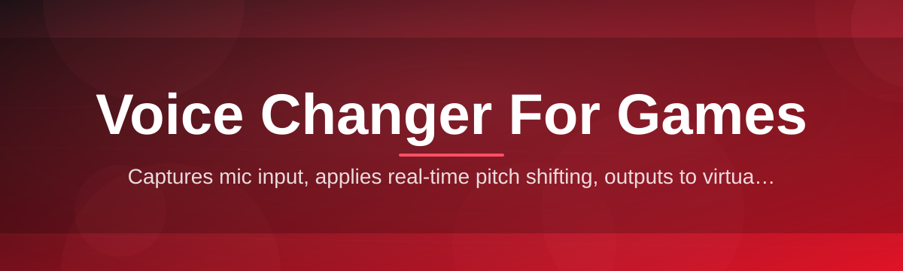
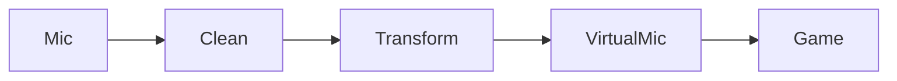

# voice-changer-companion 🎙️🕹️

  

*Real-time voice transformation for gamers who'd rather ship a laugh than a support ticket.*

  

## 🧭 Overview

Voice chat in multiplayer games has been stuck in the same rut for a decade: either you sound like yourself (boring), or you install some bloated "streaming suite" that eats 2GB of RAM to change your pitch by three semitones. **voice-changer-companion** is a solo-built, no-nonsense voice changer for games that sits between your microphone and your game's voice chat, transforming your voice in real time with latency low enough that your squad won't notice a delay before your callout lands.

This exists because every other voice changer for games tool out there either wants a subscription, phones home to a cloud server for "AI processing" (adding 300ms of lag and a privacy question mark), or ships with a UI that looks like it was designed to sell you three other products. This one doesn't. It's a standalone Windows executable that intercepts your mic input, runs it through a local voice engine, and hands the result to Discord, VRChat, Valorant comms, or whatever virtual mic your game expects — instantly.

Who it's for: streamers who want a consistent character voice without editing every VOD, roleplay server regulars who need to *be* the dragon, competitive players who want to mask their voice for privacy, and anyone who's ever wanted to troll their party chat with a demon voice mid-raid. If you've ever thought "I just want this to work without a tutorial," this is built for exactly that person.

---

## 🔥 What's Actually Inside

> [!NOTE]
> Every feature below was built because the alternative made someone (usually me) close the app in frustration. That's the whole design philosophy.

1. **Zero-latency local processing** — no cloud round-trip. Your voice never leaves your PC, which means no "please wait for AI" spinner mid-clutch.

2. **Virtual mic routing done right** — one click auto-detects your game's expected input device and routes the transformed audio there. No manual driver juggling.

3. **Live pitch & formant sculpting** — drag two sliders and go from your normal voice to something that sounds like it crawled out of a cave, without the robotic warble cheaper tools produce.

4. **One-key voice presets** — bind a hotkey to swap between "Normal," "Deep," "Chipmunk," or a custom preset mid-match, mid-sentence, mid-anything.

5. **Background noise gate built-in** — keyboard clacks and fan noise get filtered before transformation, so your voice changer doesn't amplify your room's problems.

6. **Overlay-friendly status HUD** — a tiny, optional on-screen indicator shows which preset is active, so you never accidentally scream in "Robot" during a serious call.

7. **Per-game profiles** — save separate input/output routing and presets per game, because your Discord setup and your VRChat setup have nothing in common.

8. **Offline by design** — no account, no login wall, no telemetry ping before you can press play.

9. **Single-file portability** — the whole thing runs from one executable. Move it to a USB stick, run it on a friend's PC, done.

10. **Instant undo** — a panic hotkey reverts to your raw mic in under a frame, for when the effect stops being funny and starts being a liability.

---

## 🚀 Before / After

| | Old workflow | With voice-changer-companion |
|---|---|---|
| **Setup time** | 20+ minutes of driver config | Under 2 minutes |
| **Latency** | 150–400ms cloud round-trip | Local, near-instant |
| **Cost** | Monthly subscription | One-time, own it forever |
| **Privacy** | Voice sent to a server | Never leaves your machine |
| **UI** | Cluttered dashboard | One window, clear controls |
| **Game compatibility** | Manual virtual mic config | Auto-detected routing |
| **Crashes** | Frequent, silent | Logged, rare, self-healing |

---

## 🏁 How to Get Started

1. Visit the landing page (button above) and grab the latest build — it's a single Windows executable, nothing else required.

2. Run it. Windows SmartScreen might flag an unsigned app on first launch — click "More info" → "Run anyway." This is normal for solo-dev tools without a code-signing cert.

3. Pick your microphone as input and your game's voice chat device as output. The app suggests the correct virtual mic automatically for major titles.

4. Choose a preset, hit "Start," and talk. Your game hears the transformed voice; you hear your normal voice in your own headset monitor.

> [!TIP]
> Bind your favorite preset and the panic-revert hotkey *before* your first ranked match. Muscle memory beats menu-diving when the round's already live.

---

## 💻 System Requirements

   

<strong>Full requirements checklist</strong>

- Windows 10 (64-bit) or Windows 11

- Any working microphone (USB or 3.5mm)

- 100MB free disk space

- No .NET, no Python, no runtime installs — it's a standalone executable

- Administrator rights recommended for virtual audio device registration on first run

> [!IMPORTANT]
> There is no macOS or Linux build. The audio driver hooks this tool relies on are Windows-specific by design — that's how it keeps latency this low.

---

## ⚙️ How It Works

The pipeline is intentionally simple — fewer moving parts means fewer things to break mid-session.

1. **Capture** — your raw microphone stream is grabbed at the driver level, bypassing Windows' default audio enhancements that add unwanted latency.

2. **Clean** — a lightweight noise gate strips background hiss and keyboard clatter before anything else touches the signal.

3. **Transform** — pitch, formant, and preset effects are applied locally through the voice engine, entirely on your CPU.

4. **Route** — the processed audio is pushed to a virtual microphone device that your game or Discord reads exactly like a normal mic.

5. **Monitor** — an optional loopback lets you hear the transformed voice yourself, so you're never surprised by what your team hears.

---

## 🧩 Troubleshooting

**Q: My game doesn't show the virtual mic in its audio settings.**
A: Restart the game after launching voice-changer-companion — most engines enumerate audio devices only once at startup.

**Q: There's a slight echo when I talk.**
A: Disable "Listen to this device" in Windows Sound settings for your real mic — the app's own monitor loopback is enough and stacking both causes double audio.

**Q: The pitch slider sounds robotic at extreme settings.**
A: That's physics, not a bug — push formant shift alongside pitch instead of pitch alone for a more natural extreme voice.

**Q: Windows Defender flagged the executable.**
A: Common for unsigned indie tools. Check the SHA256 hash listed on the landing page against your downloaded file if you want to verify integrity yourself.

**Q: My hotkey isn't switching presets in-game.**
A: Some games run with elevated privileges and block global hotkeys from non-elevated apps — try running voice-changer-companion as Administrator.

**Q: Audio cuts out for a second when I switch presets.**
A: That's the engine reinitializing the filter chain — it's sub-200ms and intentional to avoid audio artifacts from a hot-swap.

---

## 🎨 UI / UX Details

> [!TIP]
> The whole interface is built to be operated one-handed while your other hand is on WASD or a controller.

- **Themes** — Dark (default), Light, and "Terminal" (green-on-black, for the nostalgic).

- **Keyboard shortcuts**:

  | Action | Default Key |
  |---|---|
  | Toggle voice changer | `Ctrl+Shift+V` |
  | Panic revert to raw mic | `Ctrl+Shift+R` |
  | Next preset | `Ctrl+Shift+]` |
  | Previous preset | `Ctrl+Shift+[` |
  | Open overlay HUD | `Ctrl+Shift+H` |

- **Settings persistence** — every profile, hotkey, and slider position is saved locally in a single config file; no cloud sync, no account needed.

- **Overlay HUD** — a translucent, draggable indicator that can be pinned to any screen corner, useful for streamers who want on-screen proof of which voice is active.

---

## 🤝 Contributing & Community

This started as a one-person project and issues/PRs are genuinely read, not routed to a ticket queue.

1. Found a bug? Open an issue with your Windows version, game, and steps to reproduce.

2. Want a feature? Check open issues first — duplicates get merged fast, but a clear write-up beats a "+1" comment.

3. Pull requests are welcome for bug fixes and preset additions; larger architectural changes should start as a discussion first.

> [!WARNING]
> This tool is meant for voice transformation in games and voice chat — it is not built or intended for impersonation of real individuals in a way that deceives or defrauds anyone. Use it responsibly.

---

## 📄 License

Released under the [MIT License](LICENSE), 2026. Use it, fork it, ship your own preset packs — just keep the license notice intact.

---

## ⚠️ Disclaimer

voice-changer-companion is provided "as is," without warranty of any kind. Voice transformation results vary by microphone, environment, and game engine. This is an independent, community-driven project and is not affiliated with, endorsed by, or sponsored by any game studio, platform, or voice chat provider mentioned or implied in this document. Use responsibly and follow the terms of service of whatever game or platform you're using it with.

